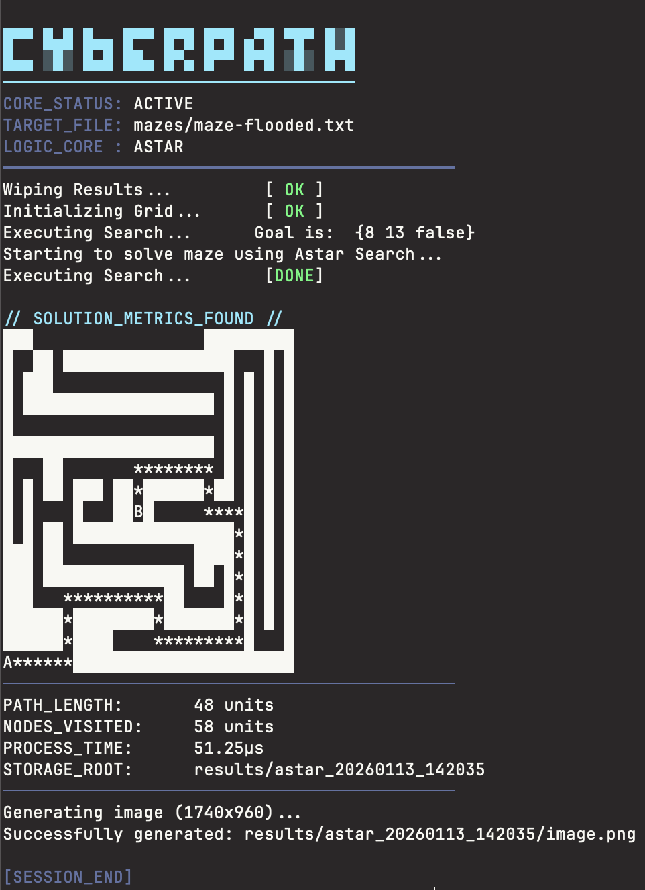
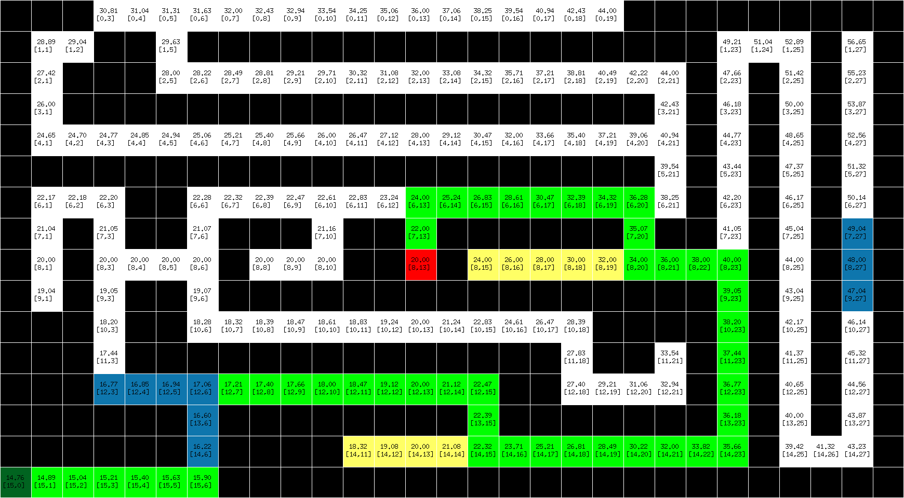

# CyberPath - A Maze Solver Implementation (Go)

A terminal-based maze solver written in **Go**, implementing multiple classical search algorithms such as **DFS**, **BFS**, **Dijkstra**, **Greedy Best-First Search**, and **A***. The program loads a maze from a text file, searches for a path from start to goal, and outputs both terminal visualization and optional image/animation results.

---

## Showcase
Below, you can see the algorithms in action. Of course, this is one example, but you get the point. You can use the terminal view to check the path or check the image / animations to see it better in action.

### Terminal Output

### Image Output


## ✨ Features

* Multiple search strategies:

  * Depth-First Search (DFS)
  * Breadth-First Search (BFS)
  * Dijkstra’s Algorithm
  * Greedy Best-First Search (GBFS)
  * A* Search
* ASCII maze visualization in terminal
* Optional frame-by-frame rendering and animation output
* Metrics reporting (path length, nodes explored, runtime)
* Modular and extensible architecture

---

## 📁 Maze Format

Mazes are plain text files where each character represents a cell:

| Symbol      | Meaning                  |
| ----------- | ------------------------ |
| `A` or `S`  | Start position           |
| `B` or `E`  | Goal position            |
| `#`         | Wall (impassable)        |
| Space (` `) | Free path                |
| `w` or `W`  | Water / weighted terrain |

Example:

```
#########
#A     B#
# ### ####
#       #
#########
```

---

## 🚀 Getting Started

### Prerequisites

* Go 1.20+ recommended

### Build

```bash
go build -o maze-solver
```

### Run

```bash
./maze-solver -file mazes/maze.txt -search dfs
```

---

## ⚙️ Command-Line Flags

| Flag       | Description                                            | Default          |
| ---------- | ------------------------------------------------------ | ---------------- |
| `-file`    | Path to maze file                                      | `mazes/maze.txt` |
| `-search`  | Search algorithm (`dfs`, `bfs`, `ds`, `gbfs`, `astar`) | `dfs`            |
| `-debug`   | Enable verbose logging                                 | `false`          |
| `-animate` | Generate APNG animation                                | `false`          |
| `-clear`   | Wipe `results/` directory before run                   | `false`          |

---

## 🧠 Search Algorithms

### DFS (Depth-First Search)

* Explores deeply before backtracking
* Low memory usage
* Not optimal

### BFS (Breadth-First Search)

* Explores level by level
* Guarantees shortest path in unweighted grids

### Dijkstra

* Computes shortest path using cumulative cost
* Suitable for weighted terrain (e.g., water)

### Greedy Best-First Search

* Chooses nodes closest to goal (heuristic-only)
* Fast but not optimal

### A* Search

* Combines path cost and heuristic (Manhattan distance)
* Optimal and efficient

---

## 📊 Output

After a successful run, the program displays:

* Final maze with solution path (`*`)
* Path length
* Nodes explored
* Execution time
* Output directory location

Results are stored under:

```
results/<algorithm>_<timestamp>/
```

If animation is enabled, frames and an animated image are generated.

---

## 🛠 Project Structure

```
.
├── main.go
├── mazes/
│   └── maze.txt
├── results/
│   └── <run_output>/
└── README.md
```

---

## 📌 Notes

* The solver expects **exactly one start and one goal**.
* Invalid algorithms or missing files will terminate execution.
* ANSI escape codes are used for terminal styling.

---

## 📜 License

This project is released under the **MIT License**.

This work is **based on and inspired by the work of [Trevor Sawler](https://github.com/tsawler)**, with modifications, improvements and extensions made in Go for educational and experimental purposes. Trevor is a great software engineer and instructor. So make sure you check his work.


---

## 🙌 Acknowledgements

Inspired by classical AI search problems and grid-based pathfinding demonstrations.
